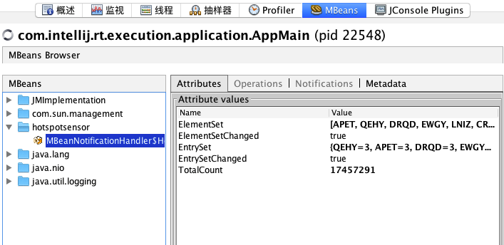

# hotspot-sensor

A high-performance lib  to detect hotspot in high-concurrency environment.

## Introduction

Use ThreadLocal counter for each thread, another consumer thread is responsible for detect hotspot, this is a lock-less structure.

## Usage

### Quick start

```java

    // build sensor and pass it to all workers threads
    HotspotSensor<String> sensor =
        HotspotSensor.<String>builder()
            .addNotificationHandler(new MBeanNotificationHandler<>()
            .build();
    
    // in worker thread 1, increase the count of some elements;
    sensor.increase("AAAA"); 
    sensor.increase("BBBB"); 
    
    // in worker thread n, increase the count of some elements;
    sensor.increase("AAAA"); 
    sensor.increase("ABCD"); 
```
That is all. You can see hot elements from JMX (under **hotspotsensor** folder) when the program is running



### Advantage usage

You can customize HotSpotSensor by customizing HotSpotSenorBuilder. Here is an example which run benchmark, you can find it on test/java/hostspotsensor/BenchmarkMain.

```java
 public static void main(String[] args) throws InterruptedException {
        // 50 threads do increase operation
        int threadNum = 50;

        //HotspotSensor detects hot element in past windowsNumber * windowSizeMills milliseconds, the default value
        // is 1 second (20 windows * 50 ms/window)
        int windowsNum = 20;
        int windowSizeMills = 50;

        //Set the threshold which is used to filter hot element. The threshold works on global scope, HotspotSensor
        // sum requests from all Collectors, then report elements who are accessed more then hotThreshold as HOT
        // elements, default value is 100.
        int hotThreshold = 3;

        //Set size of channel between Collectors and HotspotSensor, this must be bigger enough or some collector
        // thread will be blocked, the default value is 4096
        int channelSize = 512;

        //Set capacity of L1LRU of Collector, default value is 200
        int l1Capacity = 100;

        //Set capacity of L2Counter of Collector, default value is 200
        int l2Capacity = 3;

        AtomicLong sumQps = new AtomicLong(0);
        AtomicInteger times = new AtomicInteger(0);


        int durationMillis = windowSizeMills * windowsNum;

        // this handler print QPS and count of hot elements in the notification
        NotificationHandler logHandler = notification -> {
            long qps = notification.getTotalCount() / (durationMillis / 1000);
            sumQps.addAndGet(qps);
            times.incrementAndGet();
            System.out.println("QPS=" + qps + ", count(hot elements) = " + notification.getElementSet().size());
        };

        System.out.println(
            "Threads=" + threadNum + ", " + windowsNum + " windows, size=" + windowsNum + " ms , threads ="
                + hotThreshold + ", l1 capacity=" + l1Capacity + ", l2 capacity=" + l2Capacity);


        HotspotSensor<String> sensor =
            HotspotSensor.<String>builder().setWindowsNumber(windowsNum)
                .setWindowSizeMills(windowSizeMills)
                .setHotThreshold(hotThreshold)
                .setChannelSize(channelSize)
                .setL1Capacity(l1Capacity)
                .setL2Capacity(l2Capacity)
                // view notification detail by
                // jvisualvm or jconsole
                .addNotificationHandler(new MBeanNotificationHandler<>())
                // log QPS and hot
                .addNotificationHandler(logHandler)
                .build();


        List<EmitTask> tasks = new ArrayList<>();
        ExecutorService es = Executors.newFixedThreadPool(threadNum);

        for (int i = 0; i < threadNum / 2; i++) {
            EmitTask task1 =
                new EmitTask(sensor, new RandomHotEmitter(TestUtils.map("AAAA", 0.001d, "BBBB", 0.001d)), -1, -1);
            EmitTask task2 =
                new EmitTask(sensor, new RandomHotEmitter(TestUtils.map("AAAA", 0.002d, "CCCC", 0.0001d)), -1, -1);
            tasks.add(task1);
            tasks.add(task2);
            es.submit(task1);
            es.submit(task2);
        }


        TimeUnit.MINUTES.sleep(1);
        System.out.println("stopping ...");
        tasks.forEach(t -> t.stop());
        es.shutdownNow();
        es.awaitTermination(10, TimeUnit.SECONDS);
        System.out.println("stop, avg QPS=" + sumQps.get() / times.get());
    }
```

## Performance

On a laptop with macOS 10.13.1, 2.3G Intel Corei7, 16GB 1600MHz DDR3. HostSpotSensor can support up to 20,000,000 QPS with above benchamrk program.

>stop, avg QPS=20305077

